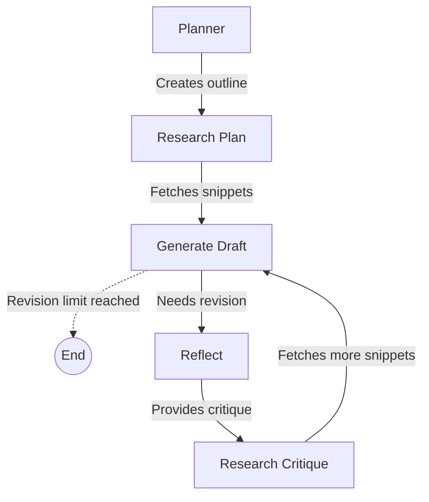

# langgraph-state-orchestration

An interactive, Human-In-The-Loop (HITL) AI essay writing system built with **LangGraph**, **FastAPI**, and **React**.

## Overview

Traditional AI agents operate as a "black box"—you prompt them, wait, and get a final output with zero control over the intermediate steps. 

This project solves that problem by breaking the AI's workflow into discrete, observable, and **editable** stages. At every step (planning, researching, drafting, critiquing), the workflow pauses. You can read, edit, or completely override the AI's state before resuming. The AI accepts your edits as its own reality and continues from there.

### Important Technologies
- **Backend**: Python, FastAPI, LangGraph, SQLite (for persistent graph checkpointing).
- **Frontend**: React, Vite, Tailwind CSS, Zustand, Framer Motion.
- **AI/LLM**: Groq (for fast inference) and Tavily (for web research).

## Features

- ⏸️ **Human-In-The-Loop (HITL)**: The execution pauses at every major node (Planner, Research, Generate, Critique), allowing you to edit the AI's intermediate outputs.
- 🕒 **Time Travel**: Every node execution is saved. You can browse the state history, rewind to any past checkpoint, and fork a new branch of execution.
- 🔍 **State Inspection**: View the exact state (Plan, Draft, Research Snippets, Critique) at any given moment through a clean UI.
- 🔀 **Multi-Threaded**: Run and track multiple independent workflows simultaneously.

## Architecture & Workflow

The system is orchestrated by a state graph that manages the essay writing process. 



1. **Planner**: Analyzes the topic and generates a structured markdown outline.
2. **Research Plan**: Generates targeted search queries and fetches real web content.
3. **Generate**: Writes or revises the essay draft using the plan and accumulated research.
4. **Reflect**: Critiques the draft and suggests improvements (acting as a teacher).
5. **Research Critique**: Fetches additional research based specifically on the critique's demands, feeding back into the Generate step.

## Project Structure

```
├── backend/
│   ├── api/             # FastAPI routes (/workflow, /history, /graph)
│   ├── graph/           # LangGraph nodes, state, prompts, and builder
│   ├── checkpointer/    # SQLite persistent checkpointer
│   ├── main.py          # FastAPI application entrypoint
│   └── requirements.txt # Python dependencies
├── frontend/
│   ├── src/             # React components, stores, hooks, and types
│   ├── package.json     # Node.js dependencies
│   └── vite.config.ts   # Vite configuration
└── docs/
    └── guide.md         # Comprehensive user guide and tutorials
```

## Requirements

- Python 3.9+
- Node.js 18+
- [Groq API Key](https://console.groq.com/) (For LLM Inference)
- [Tavily API Key](https://tavily.com/) (For Web Research)

## Installation & Setup

### 1. Backend Setup

Navigate to the backend directory, set up your virtual environment, and install dependencies:

```bash
cd backend
python -m venv .venv

# Activate the virtual environment:
# Windows:
.venv\Scripts\activate
# macOS/Linux:
# source .venv/bin/activate

pip install -r requirements.txt
```

Create a `.env` file in the `backend/` directory and add your API keys:
```env
GROQ_API_KEY="your_groq_api_key_here"
TAVILY_API_KEY="your_tavily_api_key_here"
```

*(Optional)* You can run `python api_check.py` to verify your API keys are working correctly.

### 2. Frontend Setup

Navigate to the frontend directory and install the Node dependencies:

```bash
cd frontend
npm install
```

## Usage

You must run both the backend API and the frontend development server simultaneously.

**Terminal 1 (Backend):**
```bash
cd backend
# Make sure your virtual environment is activated
uvicorn main:app --reload
# API will run on http://localhost:8000
```

**Terminal 2 (Frontend):**
```bash
cd frontend
npm run dev
# UI will run on http://localhost:5173
```

Open `http://localhost:5173` in your browser. Enter an essay topic and click **Start**.

### Further Reading

For a detailed walkthrough of the UI, Time Travel, and advanced Human-In-The-Loop capabilities, please refer to the **[Comprehensive User Guide](./docs/guide.md)**.
